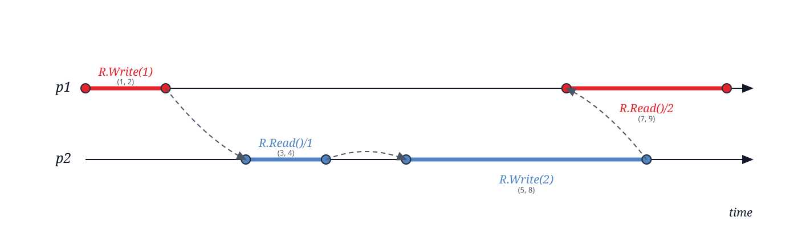

# AMECOS validator

A Scala 3 command-line validator for [AMECOS](https://doi.org/10.4230/LIPIcs.OPODIS.2024.4) object specifications, histories, orderings, and consistency models.

## Requirements

- Scala 3.8.3
- SBT 1.12.11

```sh
sbt compile
sbt test
sbt 'run examples/example.amecos'
```

The CLI accepts one `.amecos` file and reports parser diagnostics, the
resulting order, legality, and requested consistency checks.

## Example

```amecos
import "typelib/Register.amecos"

check Linearizability, SeqCons
new Register<int> R

process p1:
    R.Write(1) (1, 2)
    R.Read()/2 (7, 9)

process p2:
    R.Read()/1 (2, 4)
    R.Write(2) (5, 8)

p1.0->p2.0
p2.0->p2.1
p2.1->p1.1
```

Operation intervals are optional and default to `(0, 0)`. Ordering references
use each process's zero-based operation indexes. If no edges are supplied, the
validator searches for a legal order satisfying the requested consistency
models.

## Typelib

Reusable object definitions are in [`typelib/`](typelib):

- [`Register.amecos`](typelib/Register.amecos)
- [`Counter.amecos`](typelib/Counter.amecos)
- [`Dictionary.amecos`](typelib/Dictionary.amecos)
- [`TestAndSet.amecos`](typelib/TestAndSet.amecos)

Import a definition with a quoted, relative import. Imports are expanded
textually, may be nested, and cannot contain cycles.

```amecos
import "../typelib/Counter.amecos"
```

Object types can also be declared directly with `type`. Their operations use
`V` (validity), `S` (safety), and `L` (liveness) predicates. Predicates can
refer to `output`, `input`, `context`, `future`, and `count(...)`.

## Diagrams

Generate a diagram beside the input file:

```sh
sbt 'run --diagram examples/example.amecos'
sbt 'run --diagram --format png examples/example.amecos'
sbt 'run --diagram --format pdf examples/example.amecos'
```

SVG is the default format.


